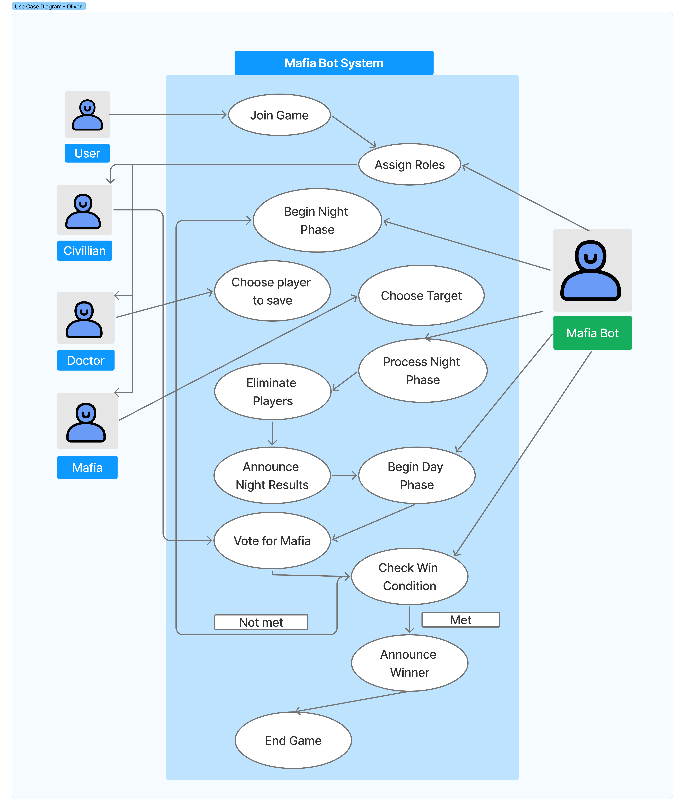

## Mafia Game Engine: State Management & Game Logic
Overview
The Mafia game is the core functionality of the MOASA bot. It utilizes a Stateful Event-Driven Architecture, where the bot tracks the game's progression (Day/Night phases) and player statuses in real-time.

Feature Description
The game manages complex interactions including role assignment, secret voting, and win-condition checks. Unlike simple one-off commands, the Mafia game requires a persistent Game State to transition between different phases based on user input and timed events.

Data Flow
Game Initialization: Users use /start to trigger the game logic.

Role Assignment: The bot assigns roles (Mafia, Doctor, Citizen) and updates the Datastore.

Phase Cycle:

Night Phase: Mafia and Doctor submit actions via DMs or private channels.

Day Phase: Players discuss and vote via slash commands in the public channel.

Processing: The Decision Logic checks if the voting threshold is met.

State Update: Upon execution or murder, the bot updates the player's "Alive" status in the Datastore.

Win Condition Check: After each phase, the bot evaluates if the number of Mafia members equals or exceeds the number of Citizens.

Architecture Diagram (System Context & Flow)
The Mafia logic follows a circular flow where user interactions continuously update the internal Game State Storage, which then determines the next outcome displayed to the Discord channel.

https://github.com/CSS360-2026-Winter/MOASA-CSS360-Discord-Bot/blob/verify-v1.0/Untitled.png?raw=true

Relevant Code
src/commands/mafia.js: Main command handler for game flow.

src/logic/gameState.js: In-memory object/store managing player lists and roles.

src/logic/evaluator.js: Logic for determining winners and processing vote results.

Architectural Significance
The Mafia game engine highlights the bot's ability to handle Asynchronous State Transitions.

Modularity: The game logic is decoupled from the Discord API wrapper, allowing for easier debugging of game rules.

Persistence: By using a dedicated state storage, the bot can maintain game integrity even when multiple events (like simultaneous votes) occur.

## Activity Diagram: Mafia Game Lifecycle

### Overview
This activity diagram represents the full lifecycle of a Mafia game from a player interaction perspective.
It models the sequence of actions and decisions taken by both players and the bot, beginning with player recruitment and ending with win condition evaluation and game termination.

### Diagram

### Description
The flow begins when a user executes the `/join` command. If no recruitment window is active, the bot opens a timed join window and registers the initiating player.
Additional players may join until the countdown expires.

Once recruitment closes, the bot checks whether the minimum number of players has been met. If so, roles are assigned and stored in memory, and the game enters the night phase.

During the night phase, Mafia members secretly choose a target while the Doctor selects a player to protect.
The bot resolves these actions and announces the outcome at the start of the day phase.

During the day phase, players discuss publicly and vote to eliminate a suspect. If a tie occurs, the voting process repeats.
After a player is eliminated, the bot evaluates win conditions. If no win condition is met, the game returns to the night phase and the cycle continues.

The game ends when a win condition is satisfied, at which point the bot announces the winner and terminates the game session.

### Architectural Significance
This activity diagram highlights:
- The **event-driven game loop** used by the bot
- Decision points that control phase transitions
- How asynchronous user input and timed events affect game progression

## Control-flow: User Command Handling

### Overview
This diagram illustrates how user-issued slash commands /join, /rule, /role, /mycommands, /reset, /mafia role are processed by the bot.
This section focuses on the short-lived execution path triggered by a single user interaction.

### Execution Steps
1. A user executes a slash command
2. The event listener extracts the command name
3. The corresponding command module is located in the `commands` directory
4. The command's `execute(interaction)` function is called
5. The command reads or updates the game state when required
6. A response is generated based on conditional logic
7. The bot replies to Discord (optionally ephemeral)

### Command Examples
Although all commands share the same execution pipeline, their internal logic differs.

- `/join` : Starts player recruitment and registers the user into the game. If at least three players join within 15 seconds, roles are automatically assigned.
- `/rule` : Displays the game rules.
- `/role` : Shows the player's own role and available actions.
- `/mycommands` : Lists the commands currently available to the player.
- `/reset` : Resets the Mafia game.
- `/mafia role` : Displays all roles in the Mafia game.

### Architectural Significance
All commands share the same execution pipeline.

- Event Layer: receives Discord events
- Command Layer: handles command-specific logic
- State Layer: manages game data

This design allows new commands to be added without modifying the event listener.
Low coupling with the game state also improves maintainability and debugging.

## UML Class Diagram: Command Dispatch + Shared Game State 

### Diagram

### What it shows
This diagram documents the bot’s command architecture. `InteractionCreateEvent` receives a Discord interaction and dispatches to a `Command` implementation based on `interaction.commandName`. Each command module implements `execute(interaction)`.

### Key relationships
- `InteractionCreateEvent` -> `Command`: dispatches by command name
- `JoinCommand` -> `GameState`: adds players and assigns roles (`addPlayer()`, `setRole()`)
- `RoleCommand` and `MyCommandsCommand` -> `GameState`: reads player role (`getRole()`)
- `ResetCommand` -> `GameState`: clears in-memory state (`reset()`)

### Why it matters
This structure keeps Discord event handling separate from game logic. Adding a new command only requires a new `Command` module, while `GameState` remains the single source of truth for shared game data.

## Use Case Diagram: Role-Based Interaction

### Overview
This diagram depicts how players interact with the Mafia Bot, specifically how user capabilities change after role assignment.

### Diagram

### Description
The diagram focuses on how player permissions change throughout a game. A generic user joins the game and is assigned a specific role by the bot's assignment logic. This transition enables role-specific functionality, such as the Doctor's ability to save players or the Mafia's ability to select targets. The Mafia Bot further automates the game by handling processes such as phase transitions, win-condition checks, and game termination.

### Architectural Significance
The use case diagram defines the bot's access control and game state management.
- Role-based permissions: Grants access to commands based on assigned role
- Phase-restricted interaction: Aligns player inputs with the game's current phase