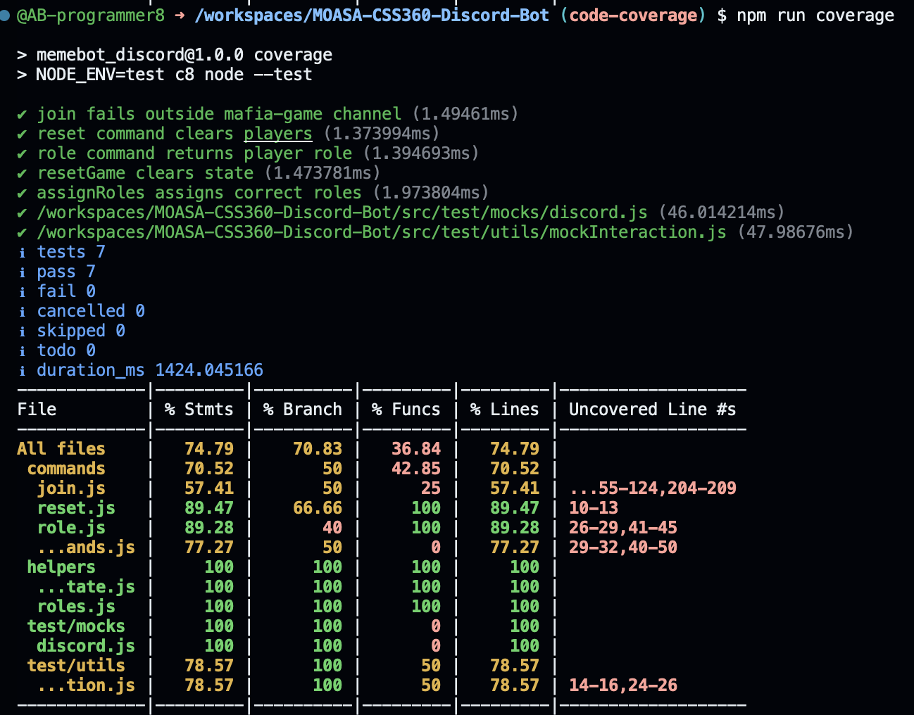

# Code Analysis Report(1)

## Minheekim – Code Smells & Technical Debt

(1) Code Smells & Technical Debt

## Issue 1: Hardcoded Role Definitions in mafiaRole.js

Problem: All role data (name, faction, description, win condition) is stored as hardcoded objects inside the command file.

Impact: Changing game rules requires modifying source code and redeploying the bot.
This also prevents reuse of role data across other features such as help commands or game logic validation.

Recommendation: Move role definitions into a dedicated configuration or data module such as:

/data/roles.js
Then import it wherever needed.

## Issue 2: Mixed Responsibilities in Command Files

!(Seen in mafiaRole.js and role.js)!

Problem:
Command files handle multiple responsibilities: game logic lookup, formatting output, UI response creation, business rules

Impact: Commands become difficult to test and modify. Any change in game rules risks breaking message formatting.

Recommendation
Split into layers:
service layer (game logic)
presentation layer (Discord reply formatting)

## Issue 3: Global Mutable Game State in gameState.js Usage

!(Observed in role.js)!

const role = playerRoles.get(interaction.user.id);

Problem: Game state is accessed directly from multiple modules without controlled access.

Impact: State corruption may occur when multiple commands modify or read the state simultaneously.
This makes debugging inconsistent game behavior difficult.

Recommendation: Encapsulate game state behind functions or a class:

getPlayerRole(userId)
setPlayerRole(userId, role)

### User Story

As a developer, I want game data and state logic separated from command handlers so that new features can be added without breaking existing gameplay.

# Code Analysis Report(2)

(2) Cyclomatic Complexity Assessment

1. rules.js

execute()
Branching: CC = 1

explanation: 
This function only builds an embed and replies to the interaction. It follows a single linear execution path and contains no decisions or loops. Therefore the risk of logic errors is minimal.

2. roleCommands.js (mycommands)

execute()
Branching: if (!role) → 1 , CC = 2

explanation:
The function checks whether the user has a role and responds accordingly. This is a simple guard condition and does not significantly increase complexity.

3. role.js

execute()

Branching: if (!role) → 1
ROLE_COMMANDS[role] || "Good luck!" → 1 (logical branch)
CC = 3

explanation:
This method includes a validation branch and a fallback behavior. It introduces slightly more complexity but remains easy to understand and maintain.

4. mafiaRoles.js

execute()

Branching: for (const role of Object.values(ROLES)) → 1, CC = 2

explanation:
The loop iterates over predefined roles to populate the embed. Although iterative, the behavior is deterministic and low risk.

5. join.js
execute()

Branching count:

Code	Count
if (joinOpen)	1
if (joinedPlayers.has(userId))	1
while (remaining > 0)	1
if (!joinOpen) break	1
try/catch	1
if (finalSize < 3)	1
else	1

CC = 1 + 7 = 8

generateJoinText()

Branching:
CC = 1

Complexity Interpretation
File:    rules.js    roleCommands.js    role.js    mafiaRoles.js    join.js
                	
Function: execute    execute            execute     execute         execute          
                
CC:       1           2                 3           2               8

Risk:     trivial     very low          low         very low        moderate

explanation:
The majority of the bot’s commands have very low cyclomatic complexity, indicating clear and maintainable logic.However, join.js has significantly higher complexity because it manages game state, countdown timing, player validation, and role assignment in a single method. This increases the likelihood of edge-case bugs such as race conditions, inconsistent state, or timing issues.

Refactoring Recommendation

The join command should be refactored into smaller functions:
player validation
countdown timer
UI update logic
game start logic
Separating these responsibilities would reduce complexity and improve maintainability.

# Code Analysis Report(4)

## Alexandra – Test Coverage & Quality Assessment

### Overview
This section of the report measures the test coverage of our Mafia Discord Bot in order to identify any weaknesses in our code structure, logic branching, and overall maintainability.

Test coverage was measured using:

* node --test (Node.js's built-in test runner)
* c8 (a JavaScript code coverage tool)

The test was executed using:

* NODE_ENV=test c8 node --test

All 7 tests that I implemented for the test coverage analysis were passed successfully.

### Coverage Results

The statement and line coverages are relatively strong (~75%), which indicates that most of our code paths are tested. However, the function coverage is significantly lower, which means that several functions for the test were not fully exercised.

### Components Covered by Tests

1. Command Logic

The following commands were tested:

* join.js for channel validation
* reset.js for state clearing
* role.js for role retrieval behavior
* role assignment logic was also tested via helpers

2. Game State Helpers

The following helper functions reached 100% coverage:

* resetGame()
* assignRoles()

These functions verified that the code properly clears the game state, assigns roles correctly, and maintains consistent game data. 

### Technical Challenges

I came across various technical challenges as I was measuring test coverage for this report. Below are descriptions of said issues, as I thought they were important to mention. 

Issue 1: ESM vs CommonJS Compatibility

The Mafia Bot project uses:
"type": "module"

Discord.js is distributed as a CommonJS module, so this caused runtime errors during the execution of my test coverage analysis. Errors included named export errors and constructor initialization failures. 

Resolution:

I adjusted the import structures to use default imports and prevent Discord-specific constructors from executing during tests by wrapping them in environment checks: if (process.env.NODE_ENV !== "test"). This allowed logic to be tested separately from Discord's runtime behavior. 

Issue 2: Discord Runtime Code Executing During Tests

Command files exported:

The command files originally exported Discord command builders that executed at module load time, which caused test failures when Discord objects weren't available.

Resolution:

I conditionally wrapped command metadata creation to prevent any execution in the test, which improved the isolation of logic and increased the reliability of the test. 

Issue 3: Tight Coupling to Discord Client Internals

Certain command logic depended directly on Discord client internals such as cached users, which made the mocking for the tests more complicated to execute. As a result, more complex mocks were required and the isolation of logic was more difficult to implement for said tests.

### Identified Weaknesses from Coverage Results

1. Low Function Coverage (36.84%)

Although statement and line coverage are ~75%, the function coverage is significantly lower.

This indicates that some code paths weren't executed during testing, and that certain command flows weren't being fully simulated.

As an example, the recruitment flow in join.js couldn't be fully tested, as well as the countdown timing logic. 

2. join.js Has Partial Coverage (~57%)

Uncovered areas in the command include:
* Countdown loop
* Game start condition
* Minimum player failure branch
* Message edit handling

The reason these areas weren't properly covered in the test was because they depend on time-based loops, along with asynchronous Discord interactions and real-message editing behavior, which could not be mocked for these tests. 

3. Time-Dependent Logic Reduces Testability

The 15-second recruitment countdown in join.js, while helpful for the game lobby, increases complexity, slows down automated testing, and limits the branch coverage for the code. For testing environments, I'd work around that countdown in order to increase the coverage. 

### Architectural Insights from Testing

Through the process of measuring test coverage, these design limitations became visible:
* Command logic and Discord response formatting are mixed together
* The global state prevents multiple games from running at the same time
* Commands have too many responsibilities inside a singular method
* Some code executes at module load time rather than the runtime

Testing the code coverage exposed these weaknesses that weren't immediately visible during our code development, and we will consider these weaknesses moving on with our work. 

# Code Analysis Report(5)
## Ayad Abunab – Unit Tests (Task 5, Step 1.7)

### What I Implemented
I added 3 unit tests using Mocha/Chai to validate core helper behavior without needing to connect to Discord.

### Tests Added
1. **gameState.resetGame clears state**
   - Verifies `resetGame()` empties `joinedPlayers` and `playerRoles`.
   - This matters because these structures drive game flow, and stale state can break new games.

2. **loadCommands loads valid commands**
   - Creates a temporary commands folder with a valid command file that includes `data.name`.
   - Confirms `loadCommands()` registers it into `client.commands`.

3. **loadCommands warns and skips invalid commands**
   - Creates a temporary command file missing `data.name`.
   - Confirms the bot logs a warning and does not register the command.

### Why This Is Useful
These tests cover two high-value failure points:
- **State resets**: prevents bugs where players/roles carry over between games.
- **Command loading**: prevents silent failures when a command is malformed or missing metadata.

### Limitations / Next Improvements
- These unit tests do not currently cover Discord interaction flows (ex: `/join` countdown behavior) because the command mixes timing, state mutation, and Discord message editing in one function.
- A future improvement would be to refactor `join.js` to isolate:
  - player validation
  - countdown timer logic
  - reply/edit formatting
  so the core logic can be unit tested without waiting 15 seconds or mocking Discord heavily.

### Evidence
`npm test` runs all three tests successfully.

# Code Analysis Report(6)
## Sari Ando – Fuzz Testing Analysis
(6) Fuzz Testing Analysis

This report presents three representative issues discovered during fuzz testing.

## Method
I implemented a custom fuzz tester that directly invokes the bot’s interaction handler without Discord.  
The fuzzer generates randomized command names and user IDs and repeatedly calls the command execution pipeline.
The goal is to explore execution paths that normal user interaction may not reach.

---

## Issue 1: Guild Assumption Crash (Null Reference)
### Description
The `join` command assumes the guild member cache always exists.
The command accesses `guild.members.cache` without verifying that the interaction originated from a guild.

### Impact
The bot might crash when:
- command is executed in DMs
- Discord API delay
- permissions incomplete

### To Fix
Use this code: 
if (!interaction.guild || !interaction.guild.members) {
  await interaction.reply({
    content: "Server data is not available yet. Try again in a moment.",
    ephemeral: true
  });
  return;
}

## Issue 2: Asynchronous Exception Propagation
### Description
The error occurs inside an awaited async command execution and propagates through the promise queue.
Observed stack trace shows propagation through processTicksAndRejections.

### Impact
This may cause:
- Terminate the process
- Break the ongoing games

### To Fix
Add structured validation before async operations and isolate state mutation from message generation.

## Issue 3: Failure Amplification
### Description
Once a command throws an exception, the global interaction handler responds and execution flow stops.
Subsequent command logic in the same runtime context becomes unreachable.

### Impact
This may cause: 
- A single faulty command can place the bot in a degraded state where further actions cannot be validated or processed.
- This significantly reduces fault tolerance.

### To Fix
Use this code:
try {
  await command.execute(interaction);
} catch (err) {
  logError(err);
  await safeErrorReply(interaction);
}
resetTransientState();

## Conclusion
From this tester, we were able to reveal the runtime reliability and architectural robustness issues.  
The bot is currently incomplete and still lacks sufficient error handling.
Even a single malformed interaction can cause unstable behavior or halt further execution paths.  
Stability and fault tolerance can be improved by adding validation guards and isolating command execution. 
